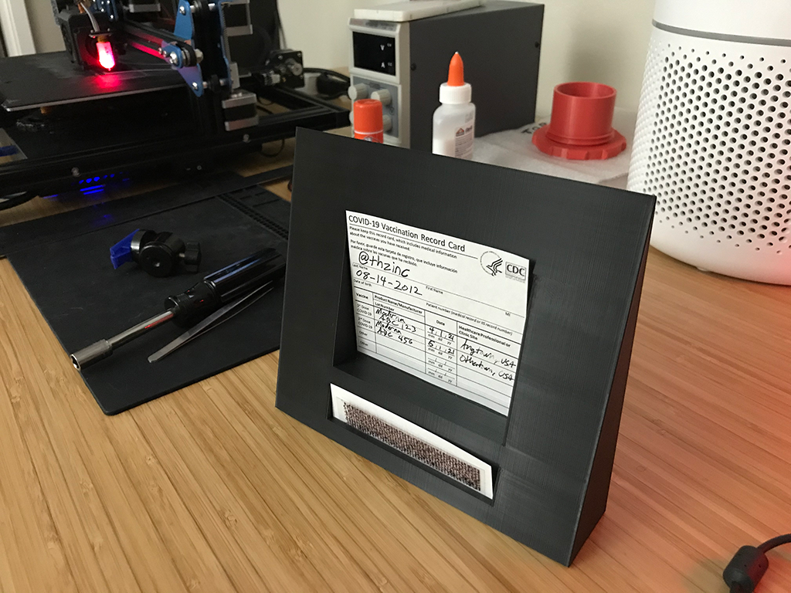

# mRNA Vaccine Visualization (and cute frame for your vaccination record card)

Some [rad humans in California sequenced the Pfizer/BioNTech and Moderna mRNA vaccines and shared it][rad-humans].

I thought it was neat and wanted to make a pretty thing. I make no claims to the actual mRNA sequence(s). I turned strings of four letters into pictures and 3D objects.




## Quickstart

This is a tiny program that runs in Node.

```bash
npm start
```

## Code of Conduct

We are committed to fostering an open and welcoming environment. Please read our [code of conduct](CODE_OF_CONDUCT.md) before participating in or contributing to this project.

## Contributing

We welcome contributions and collaboration on this project. Please read our [contributor's guide](CONTRIBUTING.md) to understand how best to work with us.

## License and Authors

[ Daniel James](https://github.com/thzinc)

[](https://github.com/thzinc/vaccination-record-card-frame/blob/master/LICENSE)
[](https://github.com/thzinc/vaccination-record-card-frame/graphs/contributors)

This software is made available by Daniel James under the MIT license.

[rad-humans]: https://github.com/NAalytics/Assemblies-of-putative-SARS-CoV2-spike-encoding-mRNA-sequences-for-vaccines-BNT-162b2-and-mRNA-1273
